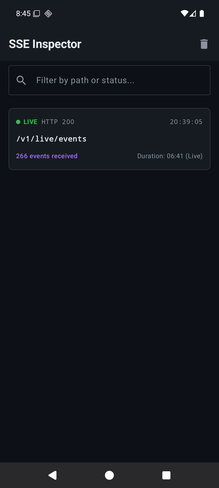
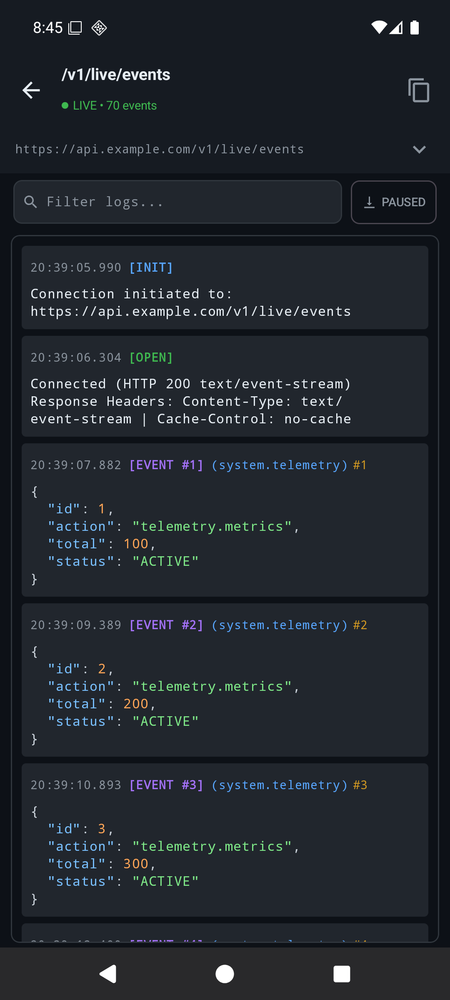

# SSE Inspector for Android (`sse-inspector`)

[](https://jitpack.io/#melkopisi/android-sse-inspector)
[](https://opensource.org/licenses/Apache-2.0)
[](https://developer.android.com)
[](https://android-arsenal.com/api?level=26)

<p align="center">
  
  &nbsp;&nbsp;
  
</p>

A lightweight, non-blocking, in-app developer tool and live terminal console designed specifically for inspecting **Server-Sent Events (SSE)** and streaming HTTP connections in Android applications.

---

## 💡 Why SSE Inspector?

[Chucker](https://github.com/ChuckerTeam/chucker) is the gold standard for in-app HTTP inspection in Android. However, **Chucker cannot inspect Server-Sent Events (SSE)**:

- Chucker functions as an OkHttp `Interceptor` and buffers response bodies via `source.readByteArray()`.
- SSE responses are **infinite, continuous text streams** (`text/event-stream`).
- When Chucker intercepts an SSE stream, it hangs indefinitely waiting for EOF, **freezing the connection and blocking all downstream event frames from ever reaching the app**.
- Excluding SSE clients from Chucker leaves developers and QA engineers completely blind to streaming traffic.

**SSE Inspector** solves this by hooking into the SSE lifecycle directly at the event source listener level:
- **Zero stream blocking:** Operates without network interceptor buffering.
- **App-First Dispatch:** The application receives every event first via `trySend()`; the inspector records the payload asynchronously afterwards (0ms latency impact).
- **Independent Task Window:** Appears as its own separate window card in Android's **Recent Apps / Overview** switcher, allowing you to multitask between your app and the inspector without replacing screens.

---

## ✨ Features

- 🖥️ **Monospace Live Terminal:** High-contrast GitHub Dark aesthetic (`#0D1117`), real-time event counter, and connection status indicator.
- 🎨 **JSON Syntax Highlighting:** Automatically indents single-line payloads and colorizes keys, strings, numbers, booleans, and nulls.
- 🌐 **RTL / Arabic Immune:** Forced `LayoutDirection.Ltr` ensures JSON brackets (`{`), quotes, timestamps, and URLs never scramble on RTL devices.
- 🔕 **Single Silent Notification:** Shows a quiet, ongoing status notification (`IMPORTANCE_LOW`) while active streams exist. Tapping opens the live terminal. Auto-dismisses when all streams disconnect.
- 🔍 **Interactive Console Controls:**
  - Auto-scroll with pause toggle.
  - Real-time text search filter (search by tag, payload text, event type, or event ID).
  - Tap any card to copy prettified JSON.
  - One-tap "Copy All" to export the entire session transcript.
- 🪟 **Multi-Window Task Isolation:** Configured with dedicated `taskAffinity`, letting you switch back and forth between your app and the inspector in Recent Apps.
- 🚀 **Zero Production Footprint:** Paired with `sse-inspector-no-op` — empty stub methods compile in release builds with 0 bytes overhead.

---

## 📦 Installation & Setup (via GitHub Maven / JitPack)

This library is hosted on GitHub and distributed via **JitPack Maven integration**, requiring zero manual Maven Central setup.

### 1. Add Maven Repository

In your project's `settings.gradle.kts`:

```kotlin
dependencyResolutionManagement {
    repositoriesMode.set(RepositoriesMode.FAIL_ON_PROJECT_REPOS)
    repositories {
        google()
        mavenCentral()
        maven { url = uri("https://jitpack.io") } // <-- Add JitPack
    }
}
```

### 2. Add Gradle Dependencies

Add `sse-inspector` to your debug/QA build variants and `sse-inspector-no-op` to your release/production builds:

#### Option A: Direct Gradle Dependencies
```kotlin
val sseInspectorVersion = "1.0.1" // see badge above for latest

dependencies {
    // Active inspector for Debug / QA builds
    debugImplementation("com.github.melkopisi.android-sse-inspector:sse-inspector:$sseInspectorVersion")
    
    // Zero-overhead No-Op stubs for Release / Production builds
    releaseImplementation("com.github.melkopisi.android-sse-inspector:sse-inspector-no-op:$sseInspectorVersion")
}
```

#### Option B: Version Catalog (`libs.versions.toml`)
```toml
[versions]
sseInspector = "1.0.1"

[libraries]
sse-inspector = { module = "com.github.melkopisi.android-sse-inspector:sse-inspector", version.ref = "sseInspector" }
sse-inspector-no-op = { module = "com.github.melkopisi.android-sse-inspector:sse-inspector-no-op", version.ref = "sseInspector" }
```
```kotlin
dependencies {
    debugImplementation(libs.sse.inspector)
    releaseImplementation(libs.sse.inspector.no.op)
}
```

> **Multi-Module / Monorepo setup:**  
> If using as an internal subproject in a monorepo, reference direct project accessors:
> ```kotlin
> debugImplementation(projects.sseInspector)
> releaseImplementation(projects.sseInspectorNoOp)
> ```

### 3. Repository Configuration (`jitpack.yml`)

When creating the standalone public GitHub repository, place a `jitpack.yml` file in the repo root to ensure JitPack builds with Java 17:

```yaml
jdk:
  - openjdk17
before_install:
  - ./gradlew --version
```

### 4. Notification Permission (Android 13+)

On Android 13 (API 33) and above, ensure your app requests `android.permission.POST_NOTIFICATIONS` at runtime so the silent ongoing stream notification can display in the status bar.

---

## 🔌 Integration Guide

### Step 1: Inject or Obtain `SseInspector`

`SseInspector` is available as a Singleton.

#### With Hilt / Dagger:
```kotlin
@Singleton
class SseClient @Inject constructor(
    private val okHttpClient: OkHttpClient,
    private val inspector: SseInspector? // Injected automatically (real or no-op)
) { ... }
```

Both `:sse-inspector` and `:sse-inspector-no-op` ship with pre-wired Hilt modules (`SseInspectorModule` and `SseInspectorNoOpModule`) binding `SseInspector`.

---

### Step 2: Hook into OkHttp `EventSourceListener`

Below is a complete, production-ready implementation of an SSE client using OkHttp `EventSource` and Kotlin Coroutines `Flow`:

```kotlin
package com.example.network.sse

import me.melkopisi.sseinspector.SseInspector
import kotlinx.coroutines.channels.awaitClose
import kotlinx.coroutines.flow.Flow
import kotlinx.coroutines.flow.callbackFlow
import okhttp3.OkHttpClient
import okhttp3.Request
import okhttp3.Response
import okhttp3.sse.EventSource
import okhttp3.sse.EventSourceListener
import okhttp3.sse.EventSources
import java.util.UUID
import javax.inject.Inject
import javax.inject.Singleton

sealed interface SseMessage {
    data object Open : SseMessage
    data class Event(val id: String?, val type: String?, val data: String) : SseMessage
    data class Closed(val reason: String = "Closed by server") : SseMessage
    data class Failure(val throwable: Throwable?, val responseCode: Int?, val responseBody: String?) : SseMessage
}

@Singleton
class SseClient @Inject constructor(
    private val okHttpClient: OkHttpClient,
    private val inspector: SseInspector?
) {
    private val sseFactory = EventSources.createFactory(okHttpClient)

    fun connect(request: Request): Flow<SseMessage> = callbackFlow {
        val sessionId = UUID.randomUUID().toString()

        // 1. Record session start
        inspector?.onSessionStart(sessionId, request)

        val listener = object : EventSourceListener() {
            override fun onOpen(eventSource: EventSource, response: Response) {
                // 2. Record handshake (inspects response code & headers only - NEVER reads body)
                inspector?.onConnected(sessionId, response)
                trySend(SseMessage.Open)
            }

            override fun onEvent(eventSource: EventSource, id: String?, type: String?, data: String) {
                // 3. APP-FIRST DISPATCH: App receives event first
                trySend(SseMessage.Event(id = id, type = type, data = data))
                
                // 4. Inspector records asynchronously afterwards
                inspector?.onEvent(sessionId, id, type, data)
            }

            override fun onClosed(eventSource: EventSource) {
                // 5. Server closed the stream cleanly
                trySend(SseMessage.Closed())
                inspector?.onClosed(sessionId)
                channel.close()
            }

            override fun onFailure(eventSource: EventSource, t: Throwable?, response: Response?) {
                val responseBody = runCatching { response?.body?.string() }.getOrNull()
                val responseCode = response?.code
                
                trySend(SseMessage.Failure(t, responseCode, responseBody))
                // 6. Record connection failure
                inspector?.onFailure(sessionId, t, responseCode, responseBody)
                channel.close()
            }
        }

        val eventSource = sseFactory.newEventSource(request, listener)

        awaitClose {
            // 7. Client cancelled or navigated away
            eventSource.cancel()
            inspector?.onCancel(sessionId)
        }
    }
}
```

---

## 📱 How to Open the Inspector

1. **Ongoing Notification:** When an SSE connection is active, tap the **"SSE Inspector • X stream(s) active"** notification.
2. **App Launcher Icon:** Open the standalone **"SSE Inspector"** app icon from your device's home screen or app drawer.
3. **Programmatically:**
   ```kotlin
   val intent = Intent(context, SseInspectorActivity::class.java).apply {
       flags = Intent.FLAG_ACTIVITY_NEW_TASK
   }
   context.startActivity(intent)
   ```

---

## 🏛️ Architecture Details

```
sse-inspector/
├── data/
│   └── SseInspectorRepository.kt       # Thread-safe in-memory ring buffer (25 sessions, 1,000 logs/session)
├── model/
│   └── SseSessionRecord.kt             # Data models (SseSessionRecord, SseLogLine, SseSessionStatus)
├── notification/
│   └── SseNotificationManager.kt       # Manages single quiet status notification (IMPORTANCE_LOW)
├── ui/
│   ├── SseInspectorActivity.kt         # Entry point activity (taskAffinity isolated)
│   ├── SseInspectorApp.kt              # Root navigation & state container
│   ├── screen/
│   │   ├── SseSessionsScreen.kt        # Historical & active sessions list
│   │   └── SseTerminalScreen.kt        # Monospace live terminal with auto-scroll & search
│   ├── theme/
│   │   ├── TerminalColors.kt           # GitHub Dark palette & JSON syntax tokens
│   │   └── SseTerminalTheme.kt         # Enforces LayoutDirection.Ltr across all locales
│   └── util/
│       └── JsonSyntaxHighlighter.kt    # 2-space JSON prettifier & regex syntax highlighter
└── di/
    └── SseInspectorModule.kt           # Hilt binding for SseInspectorImpl
```

---

## 📄 License

Apache License 2.0 — see [LICENSE](LICENSE) for details.
